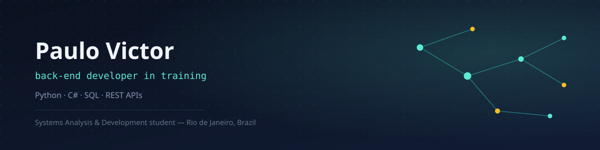

# Hi, I'm Paulo Victor 👋

---

## Back-End Developer in Training

Systems Analysis and Development student, focused on **Back-End** development. I build hands-on projects in Python, applying Object-Oriented Programming concepts, logic, and relational databases — always aiming to grow and apply good coding practices.

  
  

---

## 🧑‍💻 About me

- 🎓 Systems Analysis and Development student (Unisuam)
- ⚙️ Complementary Back-End training (Firjan/Senai)
- 💻 Ongoing Full-Stack track with freeCodeCamp (Python, JavaScript, databases, APIs)
- 🗄️ Practicing **Object-Oriented Programming** and relational databases in personal projects

---

## 🛠️ Tech Stack

### ⚙️ Back-End (main focus)

  

`Python` `C#` `Programming Logic` `OOP`

### 🎨 Front-End (complementary knowledge)

  

`JavaScript` `HTML5` `CSS3`

### 🗄️ Databases

  

`SQL` `Relational Databases` `Data Modeling`

### 🔧 Tools

  

`Git` `GitHub`

---

## 🚀 Featured Projects

| Project | Description | Tech |
| :--- | :--- | :--- |
| **[DevBank](https://github.com/paulovstack/banco-digital-poo)** | Banking system simulating deposits and withdrawals, using inheritance and encapsulation with OOP | `Python` `OOP` |
| **[TechLog Solutions](https://github.com/paulovstack/frota-techlog)** | Fleet management system (trucks and forklifts) with operating cost calculation by vehicle type | `Python` `OOP` |
| **[Pet Adoption API](https://github.com/paulovstack/api-adocao-pets)** | REST API built with FastAPI for managing pet adoptions, with data validation and HTTP error handling | `Python` `FastAPI` |

---
