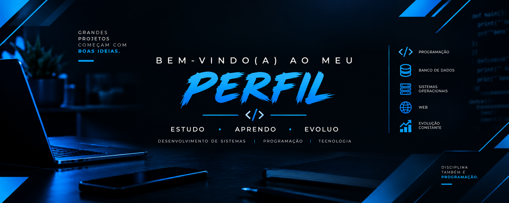

[profile_readme.md](https://github.com/user-attachments/files/32532551/profile_readme.md)

# Olá, eu sou Paulo Victor 👋

---

## Estudante de ADS | Futuro(a) Desenvolvedor(a) Back-End

Em transição de carreira para a área de tecnologia, com foco em **Back-End**. Estudo Análise e Desenvolvimento de Sistemas, back-end e construo projetos práticos em Python, aplicando conceitos de Programação Orientada a Objetos, lógica e bancos de dados relacionais.

Antes da tecnologia, atuei por mais de 4 anos em vendas — trago dessa experiência disciplina, organização e capacidade de resolver problemas sob pressão, que aplico hoje nos estudos e nos projetos.

  
  

---

## 🧑‍💻 Sobre mim

- 🎓 Estudante de Análise e Desenvolvimento de Sistemas (Unisuam)
- ⚙️ Formação complementar em Back-End (Firjan/Senai)
- 💻 Trilha Full-Stack em andamento pelo freeCodeCamp (Python, JavaScript, bancos de dados, APIs)
- 🗄️ Praticando **Programação Orientada a Objetos** e bancos de dados relacionais em projetos próprios
- 🔁 Em transição de carreira: de vendas para desenvolvimento back-end

---

## 🛠️ Tech Stack

### ⚙️ Back-End (foco principal)

  

`Python` `C# (em aprendizado — Microsoft Learn)` `Lógica de Programação` `POO`

### 🎨 Front-End (conhecimento complementar)

  

`JavaScript` `HTML5` `CSS3`

### 🗄️ Bancos de Dados

  

`SQL` `Bancos de Dados Relacionais` `Modelagem de Dados`

### 🔧 Ferramentas

  

`Git` `GitHub`

---

## 🚀 Projetos em destaque

| Projeto | Descrição | Techs |
| :--- | :--- | :--- |
| **[DevBank](https://github.com/paulovstack/banco-digital-poo)** | Sistema bancário simulando depósito e saque, com herança e encapsulamento em POO | `Python` `POO` |
| **[TechLog Solutions](https://github.com/paulovstack/frota-techlog)** | Sistema de gestão de frota (caminhões e empilhadeiras) com cálculo de custo operacional por tipo de veículo | `Python` `POO` |

---

## 📈 Em andamento

Atualmente evoluindo meus estudos em back-end e trabalhando num novo projeto: um jogo de RPG em texto, em Python, para praticar estruturação de código e lógica de jogo por turnos.
