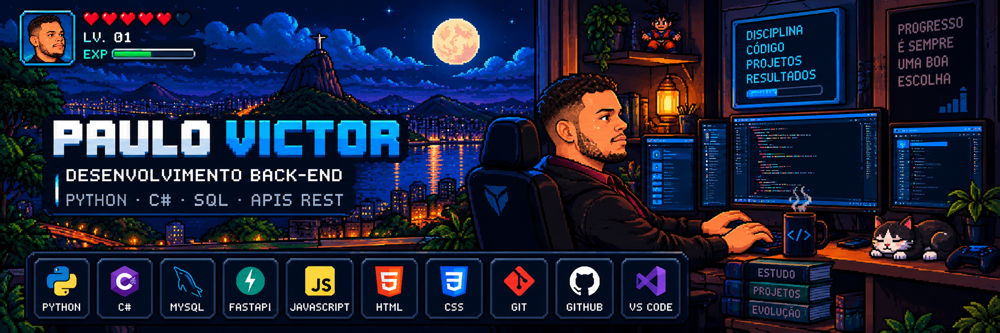

<p align="center">
  
</p>

<div align="center">

# 🎮 PAULO VICTOR

`PLAYER 01` • `BACK-END` • `ADS`

**Transformando estudo em código, um commit de cada vez.**

</div>

---

## 🕹️ PLAYER PROFILE

```text
```text
╔══════════════════════════════════════════════════════════════╗
║                                                              ║
║  PLAYER   Paulo Victor                                       ║
║  CLASS    Desenvolvedor Back-End em formação                 ║
║  CURSO    Análise e Desenvolvimento de Sistemas              ║
║  FOCO     Python • C# • APIs REST • Banco de Dados           ║
║  =================================================           ║
║  STATUS   [████████████░░░░░░] Em evolução...                ║
║                                                              ║
╚══════════════════════════════════════════════════════════════╝
```
```

Sou estudante de **Análise e Desenvolvimento de Sistemas**, com foco em desenvolvimento **Back-End**.

Uso este GitHub para registrar minha evolução através de projetos práticos. Gosto de entender o caminho completo de uma aplicação: da regra de negócio e banco de dados até a API, interface e publicação.

Atualmente também realizo formação complementar em **Desenvolvimento Back-End pela Firjan SENAI** e continuo meus estudos em desenvolvimento Full Stack.

---

## 🎒 INVENTÁRIO

<div align="center">

### ⚔️ Back-End


`Python`　`C#`　`FastAPI`　`POO`　`APIs REST`

### 🗃️ Banco de Dados


`MySQL`　`SQL`　`Modelagem Relacional`

### 🎨 Front-End


`HTML5`　`CSS3`　`JavaScript`

### 🛠️ Ferramentas


`Git`　`GitHub`　`VS Code`

</div>

---

## 🗺️ MAPA DE MISSÕES

### 🟢 MISSÃO PRINCIPAL — ExpressLog

> **Sistema web de gerenciamento de frota e viagens.**

O projeto reúne **frontend, API REST e banco de dados** em uma aplicação publicada na web.

```text
[ FRONT-END ]  ──HTTP──▶  [ FASTAPI ]  ──SQL──▶  [ MYSQL ]
GitHub Pages              Render                 Aiven
```

**Recursos desenvolvidos:**

- Cadastro e gerenciamento de motoristas
- Cadastro e gerenciamento de veículos
- Agendamento e controle de viagens
- Regras de negócio para disponibilidade da frota
- API REST com FastAPI
- Integração com banco MySQL
- Interface responsiva para computador e celular
- Deploy completo da aplicação

**Stack:** `Python` `FastAPI` `MySQL` `JavaScript` `HTML` `CSS`

<p align="center">
  <a href="https://paulovstack.github.io/ExpressLog/"><b>🎮 ACESSAR SISTEMA</b></a>
  &nbsp;&nbsp;•&nbsp;&nbsp;
  <a href="https://github.com/paulovstack/ExpressLog"><b>💻 VER CÓDIGO</b></a>
  &nbsp;&nbsp;•&nbsp;&nbsp;
  <a href="https://expresslog-pwur.onrender.com/docs"><b>📖 SWAGGER</b></a>
</p>

---

### 🏦 DevBank

`Python` `POO`

Sistema bancário simples desenvolvido em Python para praticar **Programação Orientada a Objetos**, depósitos, saques e organização de regras de negócio.

**[ ▶ VER REPOSITÓRIO ](https://github.com/paulovstack/banco-digital-poo)**

### 🚛 TechLog Solutions

`Python` `POO`

Sistema de gestão de frota com caminhões e empilhadeiras, utilizando conceitos de orientação a objetos e cálculo de custo operacional.

**[ ▶ VER REPOSITÓRIO ](https://github.com/paulovstack/frota-techlog)**

### 🐾 API de Adoção de Pets

`Python` `FastAPI` `REST API`

API REST para gerenciamento de animais, adotantes e registros de adoção.

**[ ▶ VER REPOSITÓRIO ](https://github.com/paulovstack/api-adocao-pets)**

---

## 🌳 SKILL TREE

```text
BACK-END
│
├── 🐍 Python
│   ├── Lógica de Programação
│   ├── Programação Orientada a Objetos
│   └── FastAPI / APIs REST
│
├── 🟣 C#
│   └── Em evolução
│
├── 🗃️ Banco de Dados
│   ├── SQL
│   ├── MySQL
│   └── Modelagem Relacional
│
└── 🌐 Web
    ├── HTML
    ├── CSS
    └── JavaScript
```

---

## 🏆 CONQUISTAS DESBLOQUEADAS

```text
[✓] Criar projetos utilizando Programação Orientada a Objetos
[✓] Desenvolver uma API REST com FastAPI
[✓] Integrar Python com banco de dados MySQL
[✓] Consumir uma API através de JavaScript
[✓] Publicar frontend na web
[✓] Publicar backend na nuvem
[✓] Utilizar banco de dados hospedado
[✓] Colocar uma aplicação Full Stack online
```

---

## 📜 QUEST LOG

**Missões atuais**

`01` Evoluir no desenvolvimento Back-End com Python  
`02` Avançar nos estudos de C# e .NET  
`03` Aprofundar conhecimentos em APIs e bancos de dados  
`04` Melhorar organização, testes e boas práticas de código  
`05` Construir projetos cada vez mais completos

---

## 🎓 FORMAÇÃO

```text
🎓 Análise e Desenvolvimento de Sistemas
   └─ Graduação em andamento

⚙️ Desenvolvimento Back-End — Firjan SENAI
   └─ Formação complementar em andamento

💻 Full Stack — freeCodeCamp
   └─ Estudos complementares
```

---

## 📊 PLAYER STATS

<div align="center">


</div>

> As estatísticas acima refletem apenas os repositórios que o serviço consegue analisar no GitHub e não representam nível de domínio das tecnologias.

---

## 💾 SAVE POINT

```text
> salvando progresso...
> novos conhecimentos adicionados.
> próximo nível em andamento.
```

<div align="center">

### `READY PLAYER 1?`

**Sempre em evolução. Sempre construindo.**

<a href="https://github.com/paulovstack">GitHub</a>

</div>
